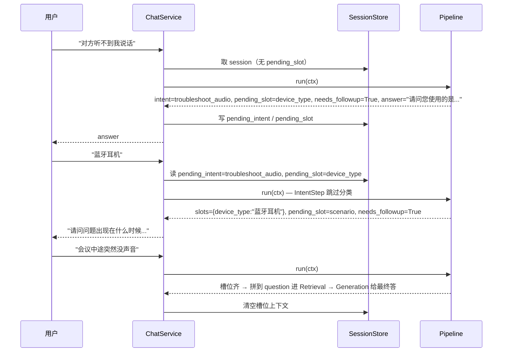

# Zoo Chat - Phase 3 设计文档

> 日期：2026-05-12
> 主题：意图识别、槽位填充、多轮对话、Pipeline 架构重构

---

## 一、目标

按学习计划（`zoo_ai_project_plan.html`）的 Phase 3 完整完成：

1. **意图识别**：用 LLM 把用户问题归类到 10 个预设意图。
2. **槽位填充**：故障类意图（音频/视频/网络）必须先收集设备类型 + 故障场景。
3. **路由分支**：greet 直接回复、out_of_scope 礼貌拒绝、其他走 RAG。
4. **多轮对话**：服务端 SessionStore 维护历史与槽位状态。
5. **可评估**：脚本化跑意图准确率、Recall@K、关键词命中率。

为支持上述能力，同时完成一次**深度重构**，把原本两层的 chat 流程
（`api → faq_chain.invoke_rag_chain`）改成 **Pipeline + 可插拔 Step** 架构。

---

## 二、架构

```
HTTP 请求
  └ RequestContextMiddleware（X-Request-ID）
      └ POST /api/chat
          └ ChatService.chat()
              └ ChatPipeline.run(ChatContext)
                    1. IntentStep      -> ctx.intent_id / confidence
                    2. RouterStep      -> 命中 greet/oos 直接回答
                    3. SlotFillingStep -> 故障类追问槽位
                    4. RetrievalStep   -> Milvus Top-K
                    5. GenerationStep  -> DeepSeek 生成回答
              └ 写回 SessionStore + 写 RAG 日志
```

### 关键模块

| 模块 | 职责 |
|------|------|
| `app/pipeline/base.py` | `ChatContext` dataclass、`PipelineStep` Protocol、`ChatPipeline` 编排器（含 metrics + trace） |
| `app/intent/intents.py` | 意图定义加载（`data/intents.json`） |
| `app/intent/classifier.py` | LLM 分类器，输出 `intent_id` + `confidence`，解析失败/越界自动降级为 `out_of_scope` |
| `app/intent/slots.py` | 各意图的必填槽位 schema |
| `app/pipeline/intent_step.py` | 调 classifier，槽位追问中跳过分类 |
| `app/pipeline/router_step.py` | 不走 RAG 的意图直接回复；置信度过低走 oos 兜底 |
| `app/pipeline/slot_filling_step.py` | 多轮槽位收集 + 槽位齐备后增强检索 query |
| `app/pipeline/retrieval_step.py` | 由原 `_retrieve_docs` 抽出 |
| `app/pipeline/generation_step.py` | 由原 `build_rag_chain` 拆出，含 `stream()` 接口预留 SSE |
| `app/memory/session.py` | 内存版 SessionStore：历史 + pending_intent + slots |
| `app/services/chat_service.py` | 编排 Pipeline、注入 session、回写 session、写 RAG 日志 |

---

## 三、意图体系

10 个意图（`data/intents.json`）：

| id | 名称 | 是否走 RAG | 是否触发槽位 |
|---|---|---|---|
| `greet` | 问候/寒暄 | 否（auto_reply） | 否 |
| `meeting_create` | 创建会议 | 是 | 否 |
| `meeting_join` | 加入会议 | 是 | 否 |
| `screen_share` | 共享屏幕 | 是 | 否 |
| `schedule_meeting` | 预约会议 | 是 | 否 |
| `troubleshoot_audio` | 音频故障 | 是 | 是 |
| `troubleshoot_video` | 视频故障 | 是 | 是 |
| `troubleshoot_network` | 网络故障 | 是 | 是 |
| `general_inquiry` | 通用咨询 | 是 | 否 |
| `out_of_scope` | 范围外 | 否（auto_reply） | 否 |

每个意图带 examples，被 IntentClassifier 在 system prompt 里引用，给 LLM 当 few-shot。

### 路由策略

- `needs_retrieval=False` → 直接 `auto_reply`，pipeline 短路。
- `intent_confidence < 0.45` → 视作 `out_of_scope`，礼貌兜底。
- 其他 → 继续后续 step。

---

## 四、槽位填充流程



槽位 schema 定义在 `app/intent/slots.py`：

```python
SLOT_SCHEMA = {
    "troubleshoot_audio":   (device_type, scenario),
    "troubleshoot_video":   (device_type, scenario),
    "troubleshoot_network": (network_type, scenario),
}
```

---

## 五、SessionStore

* 进程内 `dict`，按 `session_id` 隔离
* 字段：`history` / `pending_intent` / `pending_slot` / `slots` / `last_seen`
* TTL：默认 1 小时；惰性 GC
* 历史按"轮"裁剪，最多保留最近 20 轮

> 上线/多 worker 部署时把实现替换为 Redis 即可，接口不变。

---

## 六、API 协议

`POST /api/chat`

请求：

```json
{
  "message": "对方听不到我说话",
  "session_id": "optional"
}
```

响应：

```json
{
  "answer": "请问您使用的是哪种音频设备？...",
  "session_id": "session_1731415000000_a3f8b1",
  "latency_ms": 612.34,
  "intent_id": "troubleshoot_audio",
  "intent_confidence": 0.94,
  "needs_followup": true,
  "pending_slot": "device_type"
}
```

新增字段对前端兼容：旧前端忽略多出的字段不会报错。`history` 仍可由前端传入覆盖
服务端 session 历史（保留旧协议）。

`POST /api/chat/stream`：占位，返回 501。`GenerationStep.stream()` 已实现，
接 SSE 时只需把 `chat_stream` 改为返回 `StreamingResponse`。

---

## 七、评估方法论

### 意图分类（`scripts/eval_intent.py`）

* 数据集：`data/eval/intent_eval.jsonl`，每个意图 ≥ 6 条样本，共 60+ 条
* 指标：accuracy / per-intent precision / recall / F1 / 混淆矩阵
* 输出：`wiki/PHASE3_EVAL_REPORT.md`

```bash
python -m scripts.eval_intent          # 跑全集 + 写报告
python -m scripts.eval_intent --verbose  # 打印每条预测明细
```

### 端到端（`scripts/eval_e2e.py`）

* 数据集：`data/eval/e2e_eval.jsonl`，30 条；带 `expected_intent` + `expected_faq_id` + `expected_keywords`
* 指标：意图准确率 + Recall@K（召回中是否包含期望 FAQ） + 关键词命中率
* `--no-llm` 跳过 generation 节省 token，只评估意图与召回

```bash
python -m scripts.eval_e2e --top-k 3
python -m scripts.eval_e2e --no-llm     # 跳过生成，只跑到检索
```

---

## 八、设计权衡

### 为什么不用 LangChain Agent？

LangChain Agent 适合"工具种类多 + 选择策略复杂"的场景。本期：
- 工具数量固定（intent / slot / retrieval / generation）
- 流程顺序基本确定
用 ReAct 反而引入不可预测性 + 多次 LLM 调用，成本与延迟都大于收益。
我们用更直白的 Pipeline + Step 模式，每步单测覆盖、可观察可追溯。
进入 Phase 4 真要做工具调用时，可以在 GenerationStep 内嵌入 Function Calling，无需推翻 Pipeline。

### 为什么 Session 存在内存？

Phase 3 目标是把多轮跑通。Redis 引入额外依赖却不带来学习收益，留给后续按需替换。

### 为什么意图分类用 LLM 而不是 embedding？

学习计划明确推荐先体验 LLM 分类。Embedding 方案（cosine 相似度匹配 examples）更快更省 token，
但 prompt-based 才能学到"意图 schema 设计 + few-shot prompting + JSON 强约束 + 解析容错"
这些更通用的能力。需要时可在 IntentClassifier 接口下加一个 `EmbeddingClassifier` 替换。

---

## 九、上线 / 验收 Checklist

- [x] `pytest tests/` 全绿（含 24 个新测试）
- [x] `python -m scripts.build_milvus_index` 不再依赖脚本内置的两个超大字典
- [x] `python -m scripts.eval_intent` accuracy = **100%**（61 条样本，10 个意图全部满分）
- [x] `python -m scripts.eval_e2e --no-llm` intent accuracy = **93.33%**, Recall@3 = **100%**
- [x] `POST /api/chat`：故障类问题先反问设备类型
- [x] `POST /api/chat/stream` 返回 501 并提示用非流式接口
- [x] 现有前端不破坏
